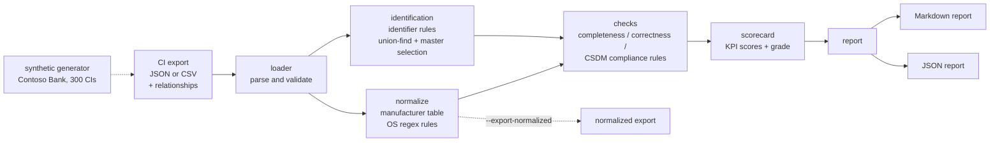

# CMDB Data Quality Toolkit

> **Disclaimer:** Representative portfolio project built with synthetic data. Not derived from any employer or client code.

A command-line tool that reads a CMDB configuration item (CI) export and produces a **health scorecard** with three scores, **completeness, correctness and compliance**, similar in spirit to ServiceNow CMDB Health. It flags duplicate CIs using identifier rules modelled on the Identification and Reconciliation Engine (IRE), normalizes manufacturer and OS names, and checks that relationships follow the Common Service Data Model (CSDM).

## Business use case

In regulated banking and insurance environments, the CMDB drives incident routing, change impact analysis, audit evidence (for example "which servers support this critical payment service?") and software licence true-ups. When the data is wrong, those processes fail without anyone noticing: changes get approved without seeing the impacted services, incidents go to the wrong team, and audit sampling turns up orphaned or duplicate assets.

This toolkit gives a CMDB or configuration manager a repeatable way to:

- measure CMDB health from a plain export, without needing admin access to the instance,
- find the duplicates and CSDM gaps behind a low score and see how to fix each one,
- add a quality gate (`--fail-under`) to a pipeline that loads data into the CMDB.

## What it demonstrates

| Area | Implementation |
|---|---|
| IRE-style identification | Identifier rules per class family in priority order (serial number, FQDN, name + IP, MAC). Placeholder serials such as `To be filled by O.E.M.` are ignored. Matches are grouped transitively with union-find. |
| Reconciliation | One master per duplicate group, chosen by data-source precedence (`ServiceNow` > `SCCM` > `ImportSet` > `Manual`), then the most recent discovery, then the most complete record. |
| Normalization | Manufacturer lookup table and OS regex rules (`RHEL 8`, `rhel8` and `Red Hat Enterprise Linux Server 8` all become `Red Hat Enterprise Linux 8`). Can export a normalized copy of the data. |
| CSDM conformance | Business application -> application service (`Consumes::Consumed by`) -> infrastructure (`Depends on::Used by`). Detects orphan CIs, missing owners and support groups, retired CIs that still have relationships, relationship types not allowed for a class pair, and relationships pointing to CIs that don't exist. |
| Staleness | CIs whose `last_discovered` date is older than N days, or that were never discovered. |
| Scorecard | Per-KPI score = share of CIs with no finding for that KPI; overall score is a weighted mean, graded A to F. Reports in Markdown and JSON. |
| Engineering | Standard library only at runtime, `argparse` CLI, `logging`, 52 pytest tests, ruff, GitHub Actions, Docker. |

## Architecture



### Rule catalogue

| Rule | KPI | What it checks |
|---|---|---|
| COMP-001 | Completeness | Required attributes per class family (for example a server needs serial number, IP, OS and manufacturer) |
| COR-001 | Correctness | Duplicate CI that is not the reconciled master |
| COR-002 / COR-003 | Correctness | Manufacturer value not normalized / not in the lookup table |
| COR-004 | Correctness | OS name not normalized |
| COR-005 | Correctness | Placeholder serial number |
| COR-006 | Correctness | Orphan server or database (no relationships) |
| COR-007 | Correctness | Stale or missing `last_discovered` |
| COR-008 | Correctness | Relationship points to a CI that doesn't exist |
| CSDM-001 | Compliance | Business application has no application service |
| CSDM-002 | Compliance | Application service has no parent business application |
| CSDM-003 | Compliance | Application service has no infrastructure mapped |
| CSDM-004 | Compliance | Business app or service without `owned_by` |
| CSDM-005 | Compliance | CI without `support_group` |
| CSDM-006 | Compliance | Retired CI still related to active CIs |
| CSDM-007 | Compliance | Relationship type not allowed for the class pair (for example business app -> server directly) |

Ownership fields are scored only under compliance, so the same gap isn't counted twice.

## Tech stack

Python 3.10+ (standard library only at runtime) · pytest · ruff · Docker · GitHub Actions

## Setup

```bash
git clone https://github.com/abdulraheemm064/cmdb-data-quality-toolkit.git
cd cmdb-data-quality-toolkit
python -m venv .venv && source .venv/bin/activate
pip install -r requirements-dev.txt
```

## Usage

```bash
# 1. Generate the synthetic Contoso Bank export (300 CIs with known issues injected)
python -m cmdb_dq generate --out data/sample_cmdb_export.json
python -m cmdb_dq generate --format csv --out data/csv     # cmdb_ci.csv + cmdb_rel_ci.csv

# 2. Analyse it
python -m cmdb_dq analyze --input data/sample_cmdb_export.json --as-of 2026-09-30 --out-dir reports

# CSV input with a separate relationship file, stricter staleness, normalized copy, quality gate
python -m cmdb_dq analyze --input data/csv/cmdb_ci.csv --relationships data/csv/cmdb_rel_ci.csv \
    --stale-days 14 --export-normalized reports/normalized.json --fail-under 85
```

Exit codes: `0` OK, `1` input error, `2` overall score below `--fail-under`.

Docker:

```bash
docker build -t cmdb-dq .
docker run --rm -v "$PWD/reports:/app/reports" cmdb-dq \
    analyze --input data/sample_cmdb_export.json --as-of 2026-09-30 --out-dir reports
```

### Input format

JSON as `{"cis": [...], "relationships": [...]}`. A `{"records": [...]}` wrapper or a bare list also works. For CSV, use one CI file plus an optional relationship file with the columns `parent,child,type`. CI columns follow the `cmdb_ci` field names (`sys_id`, `name`, `sys_class_name`, `serial_number`, `ip_address`, `fqdn`, `manufacturer`, `os`, `owned_by`, `support_group`, `install_status`, `discovery_source`, `last_discovered`, and so on). See `cmdb_dq/model.py`.

## Sample output

The complete report is in [`docs/sample-report.md`](docs/sample-report.md), with the matching JSON in [`docs/sample-report.json`](docs/sample-report.json).

```
Overall health: 83.2/100 (grade B)
  completeness    96.0  (12 CIs affected)
  correctness     64.3  (107 CIs affected)
  compliance      89.3  (32 CIs affected)
```

| Master (kept) | Master source | Duplicates | Matched on |
|---|---|---|---|
| cbk-lnx-app-061 | ServiceNow | cbk-lnx-app-061-old (SCCM) | mac_address, serial_number |
| cbk-lnx-batch-012 | ServiceNow | cbk-lnx-batch-012 (ImportSet) | name+ip_address |
| cbk-lnx-mq-067 | ServiceNow | CBK-LNX-MQ-067 (Manual) | fqdn |

These scores come from synthetic data with issues injected on purpose. They don't describe any real environment.

## Tests

```bash
pytest          # 52 tests
ruff check .
```

The synthetic generator injects issues in exact, known quantities (`cmdb_dq/synthetic.py::EXPECTED`), and `tests/test_checks.py` asserts that the analyser finds every one of them: 20 duplicates, 32 orphans, 25 stale CIs, 7 missing owners, and so on. Small hand-built CSDM models cover each rule on its own.

## Security considerations

- Works offline on export files and never connects to an instance, so no credentials are needed or stored.
- Real CMDB exports can contain internal hostnames, IP plans and staff names. Keep them out of version control. `.gitignore` excludes `reports/` and `data/private/`.
- The JSON report repeats CI names and sys_ids. Treat it as having the same classification as the source export.
- If you adapt the tool to pull data over the REST Table API, use a read-only integration user with OAuth, and keep secrets in environment variables or a vault, never in code.

## Limitations and future enhancements

- Identifier rules are a simplified model of IRE: no dependent-CI identification (such as a database instance identified relative to its host), no lookup tables and no reconciliation rules per attribute.
- The CSDM checks cover the core application layer only. Business service offerings, technical services and product models are not checked yet.
- Normalization tables are short examples. A real deployment would load them from configuration or reuse the platform's normalization data.
- Ideas for later: rule weights and thresholds in a YAML config, a Table API loader, trend tracking across runs, and an HTML report.

## Licence

MIT. See [LICENSE](LICENSE).

---

Representative portfolio project built with synthetic data. Not derived from any employer or client code. "ServiceNow", "CMDB Health", "CSDM" and "IRE" are mentioned only to describe the concepts this project models. It is not affiliated with or endorsed by ServiceNow.
